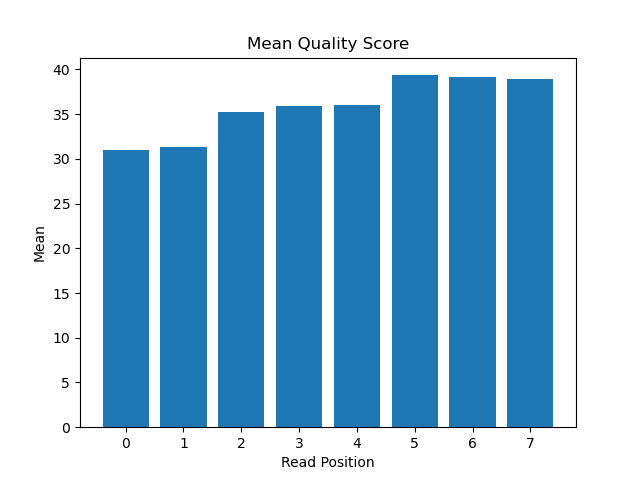
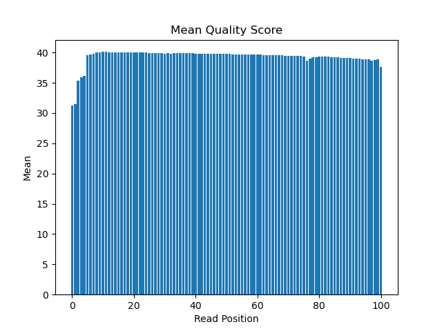
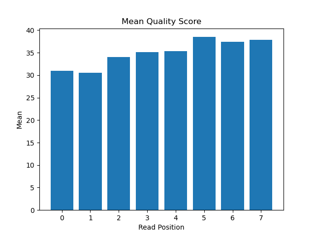
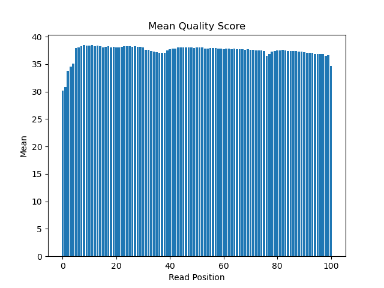

# Assignment the First

## Part 1
1. Be sure to upload your Python script.

| File name | label | Read length | Phred encoding |
|---|---|---|---|
| 1294_S1_L008_R1_001.fastq.gz |Read1|101|phred+33|
| 1294_S1_L008_R2_001.fastq.gz |Index1|9|phred+33|
| 1294_S1_L008_R3_001.fastq.gz |Index2|9|phred+33|
| 1294_S1_L008_R4_001.fastq.gz |Read2|101|phred+33|

2. Per-base NT distribution
    1. Use markdown to insert your 4 histograms here.
index1
 
read1
 
index2
 
read2
 

## Part 2
1. Define the problem
    We need to seperate samples that have been run simultaneously based on their barcodes. These reads should have a matched pair (the other end of the strand) but sometimes these barcodes are unmatched or unknown, so they need to be seperated out. 
2. Describe output
We need the reads to be seperated into files based on their information. 48 files should have a read that is part of a matched pair (24 known barcodes, each barcode has two reads), one file that has hopped barcodes from read 1, one file that has hopped barcodes from read 2, one file that has unknown barcodes from read 1, one file that has unknown barcodes from read 2. 
3. Upload your [4 input FASTQ files](../TEST-input_FASTQ) and your [>=6 expected output FASTQ files](../TEST-output_FASTQ).
4. Pseudocode
create a set of known indexes from the R1 file
with all 4 files open
    for the nth record, create temporary arrays ([header, seq, +, qualityscore]) for each of the 4 files (result=four arrays with header in position 1, seq in position 2, + in position 3, qualscore position 4)
        is there an "n" present in index1 or index2 of the nth record?
            if yes: send record from original read file to unknown file designated for that read (1 or 2), create reverse compliment variable and add to header
                unknown_counter+=1
            if no:for qscore line of nth record, are any of the phred values in qscore line < 30?
                if yes: send record from original read file to unknown file designated for that read (1 or 2), create reverse compliment variable and add to header
                    unknown_counter+=1
                if no: is index 1 in set of known indexes?
                    if not: write record from original read file to unknown file designated for that read, create reverse_compliment variable and add to header
                        unknown_counter+=1
                    if yes: create reverse complement of index2, is that reverse complement in the set?
                        if not: write to unmatched file for that read, add reverse compliment variable to header
                            unmatched_counter+=1
                        if yes: is reverse compliment of index2 equal to that read's index1?
                            if yes:write to matched file for that read, add reverse compliment to header
                                matched_counter+=1
                            if not:write to unmatched file for that read, add reverse compliment to header
                                unmatched_counter+=1
    create dictionary with index1 as key and number of occurences in matched file as value
5. High level functions
def reverse_compliment(letter: str) -> float:
"create reverse compliment of a given sequence"
return reverse_compliment
#reverse compliment check
assert reverse_compliment ("ATGC") == GCAT
assert reverse_compliment ("TACG") == CGTA
